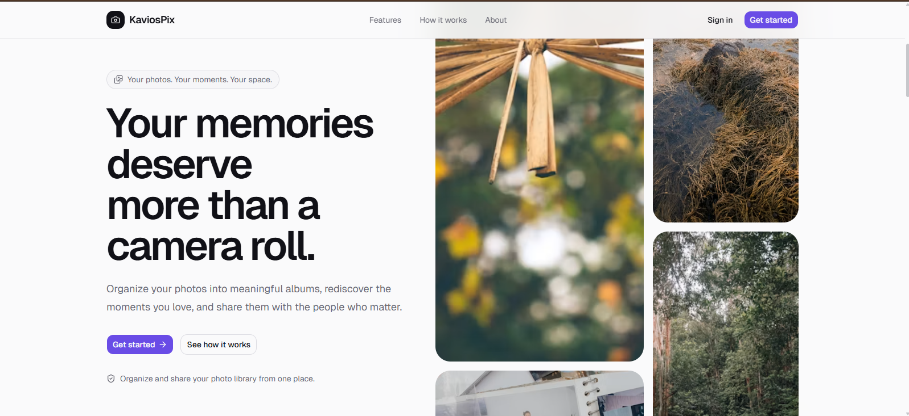
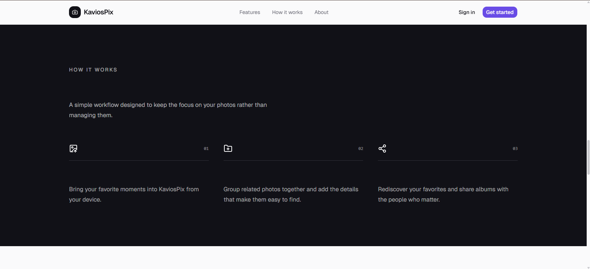
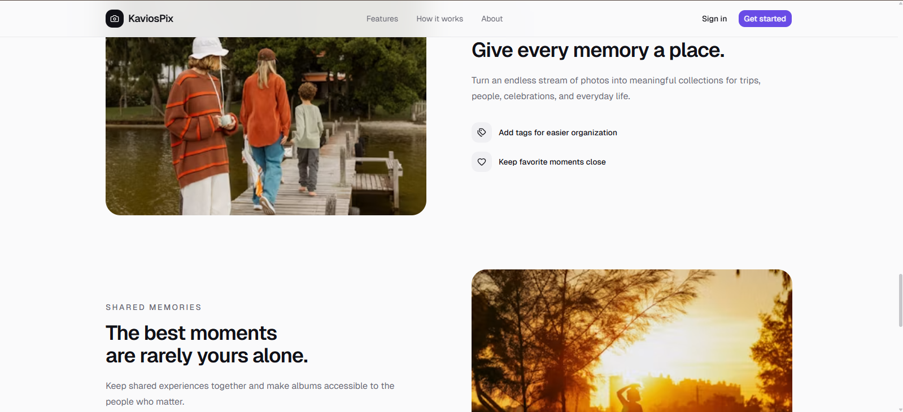
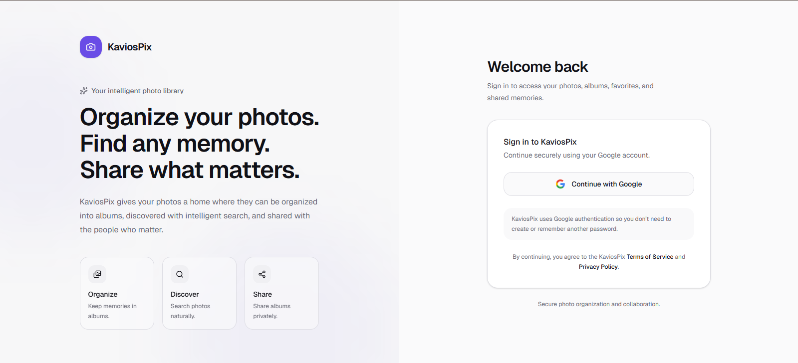
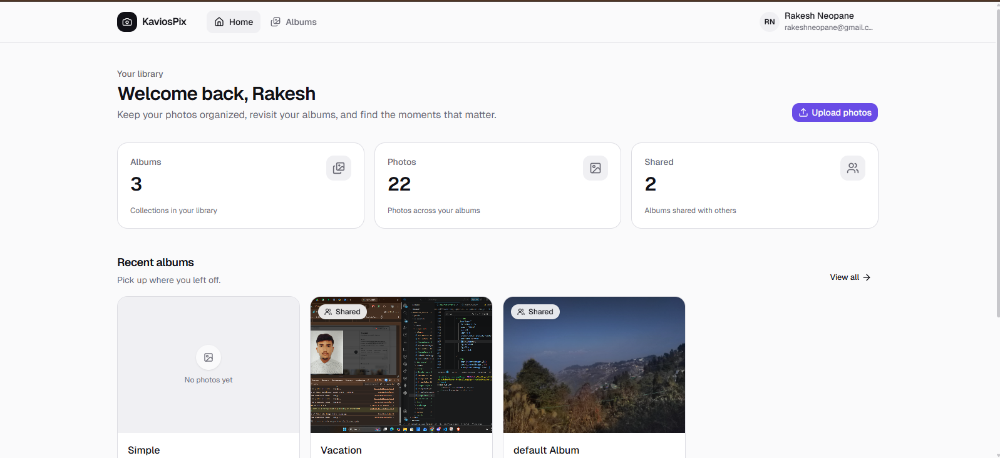
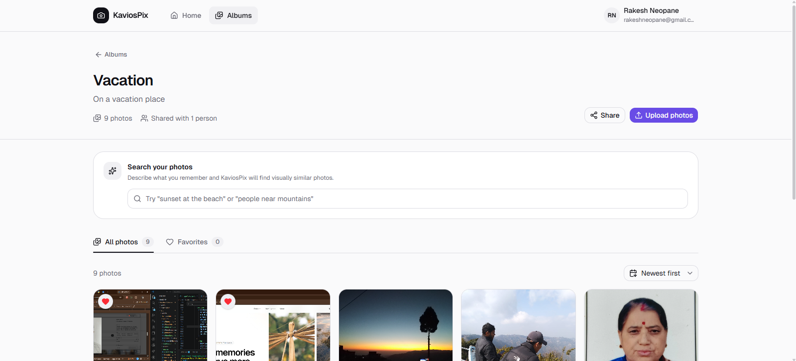
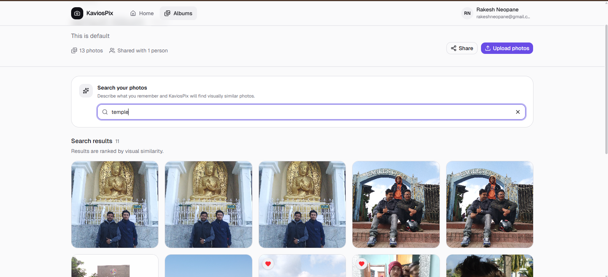
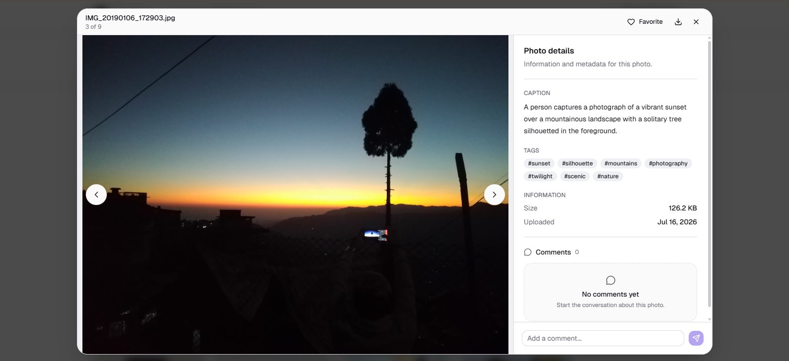
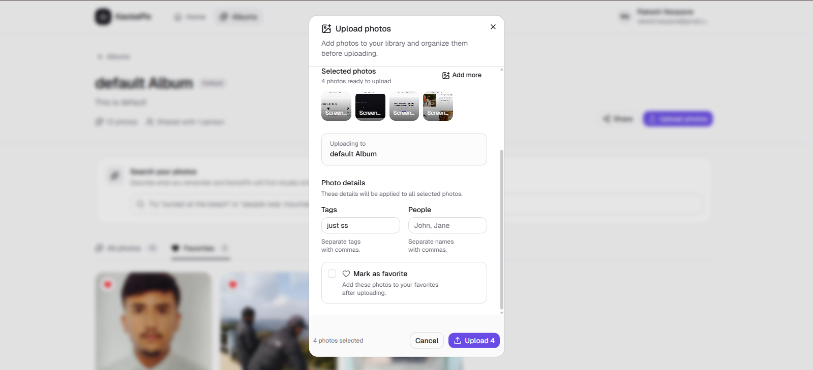

# KaviosPix — Frontend 📸

> Your memories, beautifully organized.

KaviosPix is a responsive photo-management web application built with React, Redux Toolkit, Tailwind CSS, and shadcn/ui. It lets users organize photos into albums, share albums, mark favorites, upload images in bulk, and find memories using AI-powered semantic search.

**Backend Repo:** [KaviosPix Backend](https://github.com/Rakeshneopane/kaviosPix-backend)
**AI Service Repo:** [KaviosPix AI Service](https://github.com/Rakeshneopane/kaviospix-aiservice)

---

## Table of Contents

1. [Demo](#demo)
2. [Screenshots](#screenshots)
3. [Features](#features)
4. [Tech Stack](#tech-stack)
5. [Architecture](#architecture)
   - [Application Flow](#application-flow)
   - [Routes](#routes)
   - [Project Structure](#project-structure)
6. [How It Works](#how-it-works)
   - [State Management](#state-management)
   - [Authentication Flow](#authentication-flow)
   - [AI Semantic Search](#ai-semantic-search)
   - [Image Upload Flow](#image-upload-flow)
7. [Key Frontend Decisions](#key-frontend-decisions)
8. [Getting Started](#getting-started)
9. [Deployment & CI/CD](#deployment--cicd)
10. [The Debugging Story](#the-debugging-story)
11. [What I Learned](#what-i-learned)
12. [Roadmap](#roadmap)
13. [Contact](#contact)

---

## Demo

**Live App:** [KaviosPix](https://image-app-frontend-mu.vercel.app)
🎥 **Loom Walkthrough:** [Watch Here](https://www.loom.com/share/495070d7ed004cb2a41547d0b2c2fdaa)

The public landing page is available at `/`. Authentication uses Google OAuth; after signing in, users are taken into the protected KaviosPix application.

---

## Screenshots

**Landing Page**





**Login**



**Dashboard**



**Albums**



**AI Search**



**Image Detail**



**Image Upload**



---

## Features

- 🔐 **Google OAuth2** — Sign in securely without maintaining another password.
- 🏠 **Public Landing Page** — Responsive marketing page with feature, product, and authentication entry points.
- 📁 **Album Management** — Create, edit, delete, browse, and open albums.
- 👥 **Album Sharing** — Share albums with other users while keeping owner-only actions protected.
- 📤 **Bulk Image Upload** — Upload multiple JPEG, PNG, or WebP images with optional tags, people, and favorite status.
- 🖼️ **Responsive Image Gallery** — Reusable image grid with loading skeletons, empty states, mobile-friendly actions, and image viewing.
- ❤️ **Favorites** — Mark photos as favorites and browse them separately.
- 💬 **Comments** — Add comments to individual photos.
- 📥 **Downloads** — Download photos directly from the gallery.
- 🔍 **AI-Powered Semantic Search** — Describe a photo naturally and retrieve visually relevant images.
- ⚡ **Debounced Search** — Prevents an AI request from firing on every keystroke.
- 🔄 **Silent Token Refresh** — Axios interceptors refresh expired access tokens automatically.
- 🔒 **Protected Routes** — Dashboard, albums, and album details require an authenticated user.
- 📱 **Responsive UI** — Desktop, tablet, touch, and mobile layouts with responsive navigation and controls.
- 🎨 **Reusable Design System** — shadcn/ui, Tailwind utilities, shared page layouts, dialogs, skeletons, and cards.

---

## Tech Stack

| Category | Technologies |
|---|---|
| **Core** | React, Vite, JavaScript, React Router |
| **State Management** | Redux Toolkit, React Redux |
| **UI** | Tailwind CSS, shadcn/ui, Radix UI, Lucide React, React Icons, Sonner |
| **API Communication** | Axios, FormData (image uploads) |
| **Authentication** | Google OAuth, protected client-side routes |

---

## Architecture

### Application Flow

```text
Landing Page
    ↓
Google Authentication
    ↓
Dashboard
    ↓
Albums
    ↓
Album Details
    ├── Upload Photos
    ├── Browse Photos
    ├── Favorites
    ├── AI Search
    └── Sharing
```

### Routes

**Public**

```text
/                    → Landing page
/login               → Google OAuth login
/v1/profile/google   → Google OAuth callback
```

**Protected**

```text
/dashboard            → Dashboard
/albums               → Album library
/album/:albumId       → Album details
```

Protected pages are rendered through `ProtectedRoute`, which restores the authenticated user from the backend when Redux starts empty after a full-page reload.

### Project Structure

```text
kavios-image-app/
├── public/
│   ├── faviconKP.svg
│   └── icons.svg
│
├── screenshots/
│
├── src/
│   ├── assets/
│   │   └── images/
│   │
│   ├── components/
│   │   ├── albums/
│   │   │   ├── AlbumCard.jsx
│   │   │   ├── AlbumDetailsPage.jsx
│   │   │   ├── AlbumHeader.jsx
│   │   │   ├── AlbumSection.jsx
│   │   │   ├── AlbumsPage.jsx
│   │   │   ├── AlbumTabs.jsx
│   │   │   ├── EditAlbumDialog.jsx
│   │   │   └── FeaturedAlbum.jsx
│   │   │
│   │   ├── dashboard/
│   │   │   ├── DashboardSkeleton.jsx
│   │   │   ├── DashboardStats.jsx
│   │   │   ├── RecentAlbumCard.jsx
│   │   │   └── RecentAlbums.jsx
│   │   │
│   │   ├── Footer/
│   │   │   └── Footer.jsx
│   │   │
│   │   ├── images/
│   │   │   ├── DeleteImageDialog.jsx
│   │   │   ├── FavoriteImages.jsx
│   │   │   ├── ImageCard.jsx
│   │   │   ├── ImageGallery.jsx
│   │   │   ├── ImageGrid.jsx
│   │   │   ├── ImageModal.jsx
│   │   │   ├── ImageUploader.jsx
│   │   │   ├── ImageViewer.jsx
│   │   │   └── useImageActions.js
│   │   │
│   │   ├── layout/
│   │   │   ├── PageContainer.jsx
│   │   │   └── PageHeader.jsx
│   │   │
│   │   ├── marketing/
│   │   │   ├── BenefitsSections.jsx
│   │   │   ├── FeatureShowcase.jsx
│   │   │   ├── FinalCTA.jsx
│   │   │   ├── HeroSection.jsx
│   │   │   ├── HowItWorksSection.jsx
│   │   │   ├── MarketingFooter.jsx
│   │   │   ├── MarketingHeader.jsx
│   │   │   └── ProductPreview.jsx
│   │   │
│   │   ├── modals/
│   │   │   └── CreateAlbumModal.jsx
│   │   │
│   │   ├── navbar/
│   │   │   └── Navbar.jsx
│   │   │
│   │   ├── search/
│   │   │   ├── SearchResults.jsx
│   │   │   └── SemanticImageSearch.jsx
│   │   │
│   │   └── ui/
│   │       ├── badge.jsx
│   │       ├── button.jsx
│   │       ├── card.jsx
│   │       ├── checkbox.jsx
│   │       ├── dialog.jsx
│   │       ├── dropdown-menu.jsx
│   │       ├── input.jsx
│   │       ├── label.jsx
│   │       ├── select.jsx
│   │       ├── separator.jsx
│   │       ├── skeleton.jsx
│   │       ├── sonner.jsx
│   │       └── textarea.jsx
│   │
│   ├── lib/
│   │   └── utils.js
│   │
│   ├── pages/
│   │   ├── DashBoardPage.jsx
│   │   ├── GoogleCallbackPage.jsx
│   │   ├── LandingPage.jsx
│   │   ├── LoginPage.jsx
│   │   ├── RouteErrorPage.jsx
│   │   └── RouteLoadingPage.jsx
│   │
│   ├── routes/
│   │   └── ProtectedRoute.jsx
│   │
│   ├── store/
│   │   ├── slices/
│   │   │   ├── albumSlice.js
│   │   │   ├── authSlice.js
│   │   │   └── imageSlice.js
│   │   └── store.js
│   │
│   ├── utils/
│   │   ├── aiSearch.js
│   │   └── axiosInstance.js
│   │
│   ├── App.css
│   ├── App.jsx
│   ├── index.css
│   └── main.jsx
│
├── components.json
├── eslint.config.js
├── index.html
├── jsconfig.json
├── package.json
├── package-lock.json
├── vercel.json
├── vite.config.js
└── README.md
```

---

## How It Works

### State Management

Redux Toolkit manages shared application state while component-specific UI state remains local.

| Slice | Responsible for |
|---|---|
| **`authSlice`** | Authenticated user state, restoring the user session, logout, authentication request status |
| **`albumSlice`** | Fetching albums, fetching individual albums, creating/updating/deleting albums, album request status |
| **`imageSlice`** | Image retrieval, image uploads, favorites, image updates and deletion, comments, semantic search, search results and request status |

### Authentication Flow

KaviosPix uses Google OAuth and HttpOnly cookies.

```text
User clicks "Continue with Google"
  → Browser leaves the SPA and opens backend /auth/google
  → Google consent screen
  → Google redirects to the backend callback
  → Backend sets HttpOnly authentication cookies
  → Backend redirects to frontend /v1/profile/google
  → GoogleCallbackPage navigates to /dashboard
  → ProtectedRoute dispatches fetchUser()
  → Browser sends HttpOnly cookie automatically
  → Backend returns authenticated user
  → Redux is populated
  → Dashboard renders
```

**Why `ProtectedRoute` fetches the user:** A Google OAuth redirect is a full browser navigation. Redux state exists only in memory, so it is reset when the browser reloads. The authentication cookie, however, persists. `ProtectedRoute` therefore restores the user from the backend whenever protected content loads and the Redux authentication state has not yet been populated.

**Token expiry:**

```text
API request
  → 401
  → Axios interceptor requests /auth/refresh
  → Backend validates refresh-token cookie
  → New access-token cookie is issued
  → Original request is retried
```

If the refresh token has also expired, the user must authenticate again.

### AI Semantic Search

The album-detail experience includes natural-language semantic image search.

```text
User enters a description
  → short debounce
  → Redux searchImages thunk
  → backend /image/search
  → AI service semantic search
  → matching image IDs
  → backend loads image metadata
  → ranked results displayed
```

Example searches:

```text
sunset at the beach
people near mountains
family outside
food on a table
```

Unlike a filename-only search, semantic search lets users describe what they remember about a photo. The frontend debounces the query so it does not send a backend/AI request on every keystroke.

### Image Upload Flow

`ImageUploader` supports multi-image uploads and sends the selected files using `FormData`.

Supported formats:

- JPEG / JPG
- PNG
- WebP

Users can also provide:

- destination album
- tags
- people
- favorite status

When the uploader is opened from an album, the album ID can be supplied automatically. When it is opened from elsewhere in the application, the user can select an album.

---

## Key Frontend Decisions

**Redux Toolkit instead of component-only state**
Authentication, albums, images, favorites, and search results are needed across multiple components. Redux Toolkit provides predictable shared state while local UI state remains inside individual components.

**Reusable image components**
`ImageGrid` handles the shared gallery layout, loading skeletons, and empty states. `ImageCard` handles individual photo interactions, while `ImageViewer` provides the expanded viewing experience. This avoids maintaining separate gallery implementations for normal photos, favorites, and AI search results.

**Shared image actions**
Common actions such as favorite toggling, downloads, and deletion are centralized through reusable image-action logic rather than being reimplemented in every gallery.

**shadcn/ui**
The project uses shadcn/ui primitives for dialogs, buttons, inputs, dropdown menus, selects, skeletons, and related interface elements. Components remain part of the project source and can be customized directly.

**Responsive interaction design**
Desktop interfaces can reveal controls on hover, but touch devices do not have reliable hover behavior. Image actions therefore remain accessible on smaller/touch-oriented layouts instead of depending exclusively on hover.

---

## Getting Started

Clone the frontend:

```bash
git clone https://github.com/Rakeshneopane/KaviosPix
cd kavios-image-app
npm install
```

Create a `.env` file:

```env
VITE_BASE_URL=http://localhost:5000

VITE_GITHUB_URL=https://github.com/YOUR_USERNAME
VITE_LINKEDIN_URL=https://www.linkedin.com/in/YOUR_PROFILE
```

Then start the development server:

```bash
npm run dev
```

The backend and AI service must also be configured/running for authentication, uploads, and AI search to work. See the [KaviosPix Backend](https://github.com/Rakeshneopane/kaviosPix-backend) and [KaviosPix AI Service](https://github.com/Rakeshneopane/kaviospix-aiservice) repositories for their setup instructions.

---

## Deployment & CI/CD

The frontend is deployed on **Vercel**.

```text
Push to main
  → Vercel builds the frontend
  → Successful build is deployed
  → Failed build does not replace the working deployment
```

Frontend environment variables are configured in the Vercel project settings. The backend is deployed separately and follows its own deployment configuration.

A future improvement would be to add automated tests and GitHub Actions before deployment.

---

## The Debugging Story

I started this project thinking the backend would be the hard part.

I was wrong.

The backend took about a week. The frontend took six weeks. Not because React itself was the difficult part, but because the frontend is where many invisible integration problems appeared: cookies across origins, OAuth full-page redirects, Redux state resets, hook ordering, responsive behavior, and production-only differences.

### The bug that cost me four days

The first login worked perfectly. The user appeared on the dashboard. Everything looked fine.

Then I refreshed the page.

Redux was empty and I was redirected away from the authenticated application.

Two issues were stacked together.

**Bug 1 — Redux resets on a full-page reload**

Google OAuth leaves the SPA and eventually redirects the browser back to it. That starts the JavaScript application again, so an in-memory Redux store starts fresh. The HttpOnly authentication cookie was still present.

The fix was to restore the authenticated user from the backend when protected pages load rather than depending on Redux surviving a browser reload.

**Bug 2 — A hook was placed after an early return**

The authentication effect originally appeared after a conditional return:

```jsx
if (status === "loading") return <div>Loading...</div>;

useEffect(() => {
  dispatch(fetchUser());
}, []);
```

Hooks must execute consistently on every render. Moving the hook above conditional returns fixed the second problem.

The lesson that stuck:

> **HttpOnly cookies can persist across browser reloads. In-memory Redux state does not.**

---

## What I Learned

Building KaviosPix involved much more than rendering a photo grid. Some of the most useful lessons were:

- OAuth redirects and SPA navigation behave differently.
- Authentication cookies and frontend state have different lifecycles.
- Hooks must always be called before conditional returns.
- Shared UI behavior should be extracted instead of duplicated.
- Touch interfaces cannot depend on hover.
- Loading, empty, error, and success states all need deliberate UI.
- AI-powered features need frontend request control such as debouncing.
- Production environments expose assumptions that localhost often hides.

---

## Roadmap

- **Automated testing** — Add unit and integration tests around authentication, Redux thunks, and important user flows.
- **TypeScript** — Catch more data-shape and component-contract mistakes during development.
- **Accessibility testing** — Audit keyboard navigation, focus behavior, dialogs, and image interactions.
- **Image optimization** — Add thumbnail generation and more deliberate responsive image delivery.
- **Pagination / infinite loading** — Scale album and photo views beyond small libraries.
- **CI checks** — Run tests and linting before production deployments.
- **Error boundaries and route error pages** — Provide consistent recovery UI for unexpected failures.
- **Privacy and Terms pages** — Add these before presenting them as active links in the production UI.

---

## Contact

**Rakesh Neopane**

[](https://github.com/Rakeshneopane)
[](https://linkedin.com/in/rakesh-neopane)

📧 Email: rakeshkumarneopane@gmail.com
📧 Alternate Email: lucasneopane123@gmail.com

---

*If you've ever spent four days on a bug that turned out to involve state restoration and hook ordering, this repo is for you.* ⭐